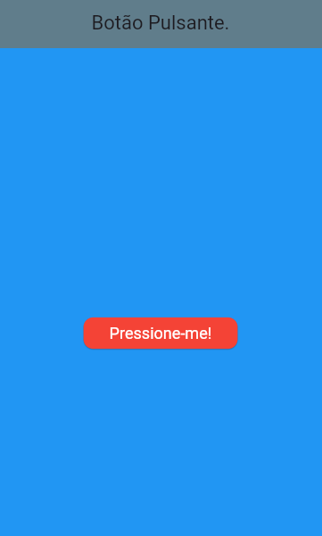

# Botão Pulsante – Alerta de Nova Mensagem

Este projeto Flutter demonstra a criação de um botão animado que simula um alerta visual de nova mensagem. O botão pulsa continuamente, chamando a atenção do usuário para uma ação importante, como ler uma nova notificação.

## 📌 Objetivo

Desenvolver um widget animado em Flutter utilizando:
- `StatefulWidget` com `SingleTickerProviderStateMixin`
- `AnimationController`, `Tween`, `ScaleTransition`
- Animações suaves com `Curves.easeInOut`
- Aplicação do botão pulsante em uma tela funcional

## ⚙️ Instalação

### Pré-requisitos:
- [Flutter instalado](https://flutter.dev/docs/get-started/install)
- Android Studio, VS Code ou outro editor compatível

### Passos para execução:

git clone https://github.com/LuizFelipeBastiao/BotaoPulsante.git
cd BotaoPulsante
flutter pub get
flutter run
Obs: certifique-se de conectar um emulador ou dispositivo físico antes de rodar o projeto.

🚀 Uso
Ao abrir o app, você verá uma tela azul com um botão vermelho animado:

O botão pulsará continuamente entre 80% e 120% do seu tamanho original.

## 💡 Captura de tela

Abaixo, uma prévia do funcionamento do botão pulsante animado:

🧑‍💻 Autores
Luiz Felipe Bastião

João Victor Pires Novaes
